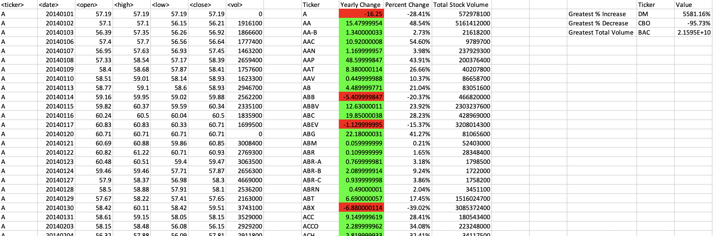

# The VBA of Wall Street

 

## Summary ##

This project used VBA to analyze real stock market data from 2014-2016. Due to the extremely large file size of `Multiple_year_stock_data.xlsx`, the `alphabetical_testing.xlsx` file was used while developing the code. This data set is smaller and allows for faster testing of code (less than 3-5 minutes).

---

## Process ##

* Created a script that loops through all the stocks for one year and output the following information:

  * The ticker symbol.

  * The yearly change from opening price at the beginning of a given year to the closing price at the end of that year.

  * The percent change from opening price at the beginning of a given year to the closing price at the end of that year.

  * The total stock volume of the stock.

* Use conditional formatting to highlight positive change in green and negative change in red.

* Returned the stock with the "Greatest % increase", "Greatest % decrease" and "Greatest total volume" in a separate table on each spreadsheet.

* Made appropriate adjustments to the VBA script in order for it to run on every worksheet, i.e., every year, just by running the VBA script once.

* The results looked as follows:

 
 
 

---

## Data Files ##

* [Test Data](Resources/alphabetical_testing.xlsx) - Used while developing VBA scripts.

* [Stock Data](Resources/Multiple_year_stock_data.xlsx) - Ran final scripts on this data.

---

## Technologies Used ##
* Microsoft Excel and VBA

---

## Author ##
Kiran Rangaraj - LinkedIn: [@Kiran Rangaraj](https://www.linkedin.com/in/kiranrangaraj/)
